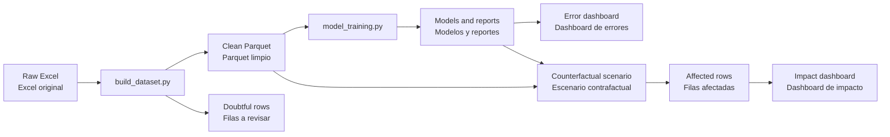

# LPSML

Pricing-model training, evaluation, and counterfactual inference for an
automotive insurance portfolio.

Entrenamiento, evaluación e inferencia contrafactual para modelos de primas de
una cartera automotor.

[English](#english) · [Español](#espanol)

## Workflow



## Repository layout

Only executable entry points remain at the repository root. Reusable code is
organized as the `lpsml` package, while local datasets and generated artifacts
have dedicated ignored directories.

```text
.
├── build_dataset.py
├── model_training.py
├── counterfactual_inference.py
├── launch_dashboard.py
├── launch_counterfactual_dashboard.py
├── configs/
│   ├── model_training.json
│   └── counterfactual_scenario.example.json
├── lpsml/
│   ├── data/          # processing and validation
│   ├── modeling/      # estimators, splitting, and model search
│   ├── reporting/     # metrics, reports, and scored datasets
│   └── dashboards/    # Streamlit pages and shared visual components
├── data/
│   ├── raw/           # local source workbooks
│   └── processed/     # clean and doubtful Parquet datasets
├── artifacts/
│   ├── training_runs/
│   └── counterfactual/
└── tests/
```

| Path                                   | English                                                          | Español                                                           |
| -------------------------------------- | ---------------------------------------------------------------- | ------------------------------------------------------------------ |
| `build_dataset.py`                   | Builds clean and doubtful datasets.                              | Genera los datasets limpio y a revisar.                            |
| `model_training.py`                  | Tunes, evaluates, and saves pricing models.                      | Ajusta, evalúa y guarda los modelos de primas.                    |
| `counterfactual_inference.py`        | Runs structured counterfactual scenarios.                        | Ejecuta escenarios contrafactuales estructurados.                  |
| `launch_dashboard.py`                | Opens the model-error dashboard.                                 | Abre el dashboard de errores del modelo.                           |
| `launch_counterfactual_dashboard.py` | Opens the portfolio-impact dashboard.                            | Abre el dashboard de impacto sobre la cartera.                     |
| `configs/`                           | Stores versioned model and scenario configuration.               | Contiene la configuración versionada de modelos y escenarios.     |
| `lpsml/`                             | Contains reusable application code grouped by function.          | Contiene el código reutilizable agrupado por función.            |
| `data/`                              | Stores local raw and processed datasets; ignored by Git.         | Contiene datasets locales originales y procesados; Git los ignora. |
| `artifacts/`                         | Stores generated models, reports, and scenarios; ignored by Git. | Contiene modelos, reportes y escenarios generados; Git los ignora. |

<a id="english"></a>

## English

### Requirements

- Python 3.10 or newer.
- A terminal such as Windows PowerShell.
- Enough memory and processing time for cross-validation. PyTorch runs on CPU
  by default in the provided configuration.

### Setup

Create and activate a virtual environment:

```powershell
python -m venv .venv
.\.venv\Scripts\Activate.ps1
```

If PowerShell blocks the activation script, allow it for the current terminal:

```powershell
Set-ExecutionPolicy -Scope Process -ExecutionPolicy RemoteSigned
```

Install the dependencies:

```powershell
python -m pip install --upgrade pip
python -m pip install -r requirements.txt
```

### 1. Build the modeling dataset

Place exactly one `.xlsx` or `.xlsm` source workbook under `data/raw` and run:

```powershell
python build_dataset.py --min-pair-count 50
```

When no input is provided, the command uses the only supported workbook in
`data/raw`. It writes `<name>.parquet` and `<name>_doubtful.parquet` under
`data/processed`. If the directory contains zero or multiple workbooks, provide
the intended path explicitly. The processing step:

- Encodes modeling features.
- Checks that premium components add up to the total premium.
- Rejects rows containing a negative premium.
- Rejects missing coverages and tariff–coverage pairs with fewer than the
  configured number of otherwise valid rows.
- Writes valid rows to the clean Parquet and rejected rows to the doubtful
  Parquet with a `DoubtfulReason`.

Always train from the clean output. Rebuild Parquet files generated before the
nonnegative-premium rule was introduced.

### 2. Train and evaluate models

Run the configured Optuna search:

```powershell
python model_training.py .\data\processed\dataset_prima.parquet `
  --config .\configs\model_training.json `
  --search optuna
```

For an exhaustive parameter grid, use:

```powershell
python model_training.py .\data\processed\dataset_prima.parquet `
  --config .\configs\model_training.json `
  --search grid
```

The holdout split is stratified by `(Pol6TTaCod, CoberturaLabel)`, preserving
every retained tariff–coverage pair in train and test at approximately the same
proportion.

The configured candidates are:

- Random Forest: native joint multi-output fitting with nonnegative leaf
  averages.
- Extra Trees: native joint multi-output fitting with nonnegative leaf
  averages.
- PyTorch: joint training with Softplus outputs and a combined component/final
  premium loss.

Each run creates a timestamped directory:

```text
artifacts/training_runs/<timestamp>/
├── run_summary.json
├── scored_dataset.parquet
├── scored_dataset.xlsx
├── random_forest/
│   ├── model.joblib
│   └── metrics.json
├── extra_trees/
│   ├── model.joblib
│   └── metrics.json
└── pytorch/
    ├── model.joblib
    └── metrics.json
```

Only enabled model types are included. Model directories also contain their
grouped error plots.

### 3. Open the error dashboard

Pass the scored Parquet generated by a training run:

```powershell
python launch_dashboard.py `
  .\artifacts\training_runs\<timestamp>\scored_dataset.parquet
```

This starts a Streamlit application with error metrics, a histogram, an
empirical CDF with P90/P95 references, and a selectable table of the policies
furthest from the mean. The table retains readable source features, original
premiums, and predicted premiums while excluding one-hot encodings.

### 4. Run a counterfactual scenario

Counterfactual scenarios separate portfolio selection, feature changes before
prediction, and premium-component adjustments after prediction:

```json
{
  "schema_version": 1,
  "name": "Vehicles aged 2 to 5 in tariff 01_CPLUS",
  "selection": {
    "all": [
      {
        "field": "antig",
        "op": "between",
        "lower": 2,
        "upper": 5,
        "inclusive": true
      },
      {
        "field": "Pol6TTaCod",
        "op": "eq",
        "value": "01_CPLUS"
      }
    ]
  },
  "feature_changes": [
    {
      "field": "TasaCasco",
      "op": "increase_pct",
      "value": 15
    }
  ],
  "prediction_adjustments": [
    {
      "component": "PrimaRC",
      "op": "increase_pct",
      "value": 10
    }
  ]
}
```

Run the included example:

```powershell
python counterfactual_inference.py `
  .\artifacts\training_runs\<timestamp>\random_forest\model.joblib `
  .\data\processed\dataset_prima.parquet `
  .\configs\counterfactual_scenario.example.json `
  --config .\configs\model_training.json `
  --output .\artifacts\counterfactual\counterfactual_output.parquet
```

The resulting Parquet contains only the affected rows and preserves the
original input values. Counterfactual feature values use a
`<Feature>_Counterfactual` suffix. Baseline and counterfactual model premiums
are added for every component and the total:

- `PrimaRC_Baseline`
- `PrimaRC_Counterfactual`
- `PrimaCasco_Baseline`
- `PrimaCasco_Counterfactual`
- `PrimaClausulaAjuste_Baseline`
- `PrimaClausulaAjuste_Counterfactual`
- `PrimaAccesorio_Baseline`
- `PrimaAccesorio_Counterfactual`
- `Prima_Baseline`
- `Prima_Counterfactual`

Selection expressions support logical `all`, `any`, and `not` groups, together
with comparison, range, membership, and null operators. Feature and prediction
changes support `set`, `add`, `multiply`, `increase_pct`, and `decrease_pct`.
Any adjustment that produces a negative premium is rejected.

Open the counterfactual-impact dashboard:

```powershell
python launch_counterfactual_dashboard.py `
  .\artifacts\counterfactual\counterfactual_output.parquet
```

The dashboard includes portfolio and average changes, a signed-change
histogram, an empirical CDF with P90/P95 references, component contributions,
business filters, and a selectable table of the policies furthest from the
mean.

### Command help

Every command exposes its full interface through `--help`:

```powershell
python build_dataset.py --help
python model_training.py --help
python counterfactual_inference.py --help
python launch_dashboard.py --help
python launch_counterfactual_dashboard.py --help
```

<a id="espanol"></a>

## Español

### Requisitos

- Python 3.10 o superior.
- Una terminal como Windows PowerShell.
- Memoria y tiempo de procesamiento suficientes para la validación cruzada.
  La configuración incluida ejecuta PyTorch sobre CPU.

### Preparación del entorno

Crear y activar un entorno virtual:

```powershell
python -m venv .venv
.\.venv\Scripts\Activate.ps1
```

Si PowerShell bloquea el script de activación, habilitarlo para la terminal
actual:

```powershell
Set-ExecutionPolicy -Scope Process -ExecutionPolicy RemoteSigned
```

Instalar las dependencias:

```powershell
python -m pip install --upgrade pip
python -m pip install -r requirements.txt
```

### 1. Generar el dataset de modelado

Colocar exactamente un Excel `.xlsx` o `.xlsm` en `data/raw` y ejecutar:

```powershell
python build_dataset.py --min-pair-count 50
```

Cuando no se indica un archivo, el comando utiliza el único Excel compatible
presente en `data/raw`. Genera `<nombre>.parquet` y
`<nombre>_doubtful.parquet` dentro de `data/processed`. Si el directorio no
contiene ningún Excel o contiene más de uno, indicar la ruta correspondiente de
forma explícita. Este procesamiento:

- Codifica las variables utilizadas por los modelos.
- Verifica que los componentes de prima sumen la prima total.
- Rechaza las filas que contengan alguna prima negativa.
- Rechaza coberturas faltantes y pares tarifa–cobertura con menos filas válidas
  que el mínimo configurado.
- Guarda las filas válidas en el Parquet limpio y las rechazadas en el Parquet
  a revisar, junto con una columna `DoubtfulReason`.

Entrenar siempre con el archivo limpio. Si el Parquet fue generado antes de
incorporar la validación de primas no negativas, volver a generarlo.

### 2. Entrenar y evaluar los modelos

Ejecutar la búsqueda configurada con Optuna:

```powershell
python model_training.py .\data\processed\dataset_prima.parquet `
  --config .\configs\model_training.json `
  --search optuna
```

Para usar una grilla exhaustiva de parámetros:

```powershell
python model_training.py .\data\processed\dataset_prima.parquet `
  --config .\configs\model_training.json `
  --search grid
```

La partición de evaluación se estratifica por
`(Pol6TTaCod, CoberturaLabel)`, de modo que cada par tarifa–cobertura retenido
quede representado en entrenamiento y evaluación en proporciones similares.

Los modelos configurados son:

- Random Forest: ajuste multisalida conjunto y promedios no negativos en sus
  hojas.
- Extra Trees: ajuste multisalida conjunto y promedios no negativos en sus
  hojas.
- PyTorch: entrenamiento conjunto con salidas Softplus y una función de pérdida
  que combina los componentes con la prima final.

Cada ejecución crea una carpeta identificada por fecha y hora:

```text
artifacts/training_runs/<timestamp>/
├── run_summary.json
├── scored_dataset.parquet
├── scored_dataset.xlsx
├── random_forest/
│   ├── model.joblib
│   └── metrics.json
├── extra_trees/
│   ├── model.joblib
│   └── metrics.json
└── pytorch/
    ├── model.joblib
    └── metrics.json
```

Sólo se incluyen los tipos de modelo habilitados. Las carpetas de cada modelo
también contienen sus gráficos de error agrupados.

### 3. Abrir el dashboard de errores

Pasar al comando el Parquet puntuado generado durante el entrenamiento:

```powershell
python launch_dashboard.py `
  .\artifacts\training_runs\<timestamp>\scored_dataset.parquet
```

Esto inicia una aplicación de Streamlit con métricas de error, un histograma,
una CDF empírica con referencias P90/P95 y una tabla configurable con las
pólizas más alejadas del promedio. La tabla conserva las variables originales
legibles, las primas originales y las primas predichas, y excluye las
codificaciones one-hot.

### 4. Ejecutar un escenario contrafactual

Los escenarios contrafactuales separan la selección de la cartera, los cambios
de variables anteriores a la predicción y los ajustes de componentes posteriores
a la predicción. Se puede tomar como base
`configs/counterfactual_scenario.example.json`.

Ejecutar el ejemplo incluido:

```powershell
python counterfactual_inference.py `
  .\artifacts\training_runs\<timestamp>\random_forest\model.joblib `
  .\data\processed\dataset_prima.parquet `
  .\configs\counterfactual_scenario.example.json `
  --config .\configs\model_training.json `
  --output .\artifacts\counterfactual\counterfactual_output.parquet
```

El Parquet resultante contiene solamente las filas afectadas y conserva los
valores originales de entrada. Los valores contrafactuales de las variables
utilizan el sufijo `<Variable>_Counterfactual`. Se agregan las primas de
referencia y contrafactuales para cada componente y para el total:

- `PrimaRC_Baseline`
- `PrimaRC_Counterfactual`
- `PrimaCasco_Baseline`
- `PrimaCasco_Counterfactual`
- `PrimaClausulaAjuste_Baseline`
- `PrimaClausulaAjuste_Counterfactual`
- `PrimaAccesorio_Baseline`
- `PrimaAccesorio_Counterfactual`
- `Prima_Baseline`
- `Prima_Counterfactual`

Las selecciones admiten grupos lógicos `all`, `any` y `not`, además de
operadores de comparación, rango, pertenencia y valores nulos. Los cambios de
variables y predicciones admiten `set`, `add`, `multiply`, `increase_pct` y
`decrease_pct`. Cualquier ajuste que produzca una prima negativa es rechazado.

Abrir el dashboard de impacto contrafactual:

```powershell
python launch_counterfactual_dashboard.py `
  .\artifacts\counterfactual\counterfactual_output.parquet
```

El dashboard incluye cambios de cartera y cambios promedio, un histograma de
cambios con signo, una CDF empírica con referencias P90/P95, contribuciones por
componente, filtros de negocio y una tabla configurable con las pólizas más
alejadas del promedio.

### Ayuda de los comandos

Todos los comandos muestran su interfaz completa mediante `--help`:

```powershell
python build_dataset.py --help
python model_training.py --help
python counterfactual_inference.py --help
python launch_dashboard.py --help
python launch_counterfactual_dashboard.py --help
```
